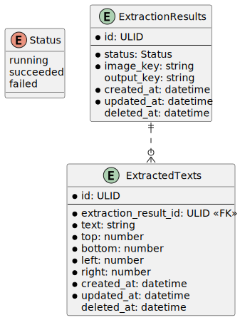

# Sample application for Google Cloud Vision

This application is sample application to use Google Vision API.

It uses [Text Annotation API](https://cloud.google.com/vision/docs/ocr) for OCR.

## Application structure

```
.
├── backend
│ ├── cmd
│ │ ├── app
│ │ └── db
│ ├── configs
│ ├── docs
│ ├── migration
│ ├── pkg
│ │ ├── configs
│ │ ├── container
│ │ ├── gateways
│ │ │ ├── database
│ │ │ └── google
│ │ ├── http
│ │ │ ├── handlers
│ │ │ └── router
│ │ ├── loggers
│ │ ├── models
│ │ ├── services
│ │ └── utils
│ └── scripts
├── deployment
├── docs
└── frontend
  ├── public
  └── src
    ├── components
    ├── configs
    ├── models
    ├── pages
    ├── repositories
    └── usecases
```

### `backend`

This is `Golang` application.

### `backend/cmd/app`

The `main.go` to launch an application.

### `backend/cmd/db`

The `main.go` to execute `golang-migrate` commands.

### `backend/configs`

This directory is storing configuration files. like google credential file.

### `backend/docs`

This directory is storing system documentation. like PlatUML file.

### `backend/migration`

This directory is for migration files to execute `golang-migrate` commands.

### `backend/pkg/configs`

This package has configurations of an application.

### `backend/pkg/container`

This package has a DI container.

### `backend/pkg/gateways/database`

This package is for database. such as connection, repositories and entities.

### `backend/pkg/gateways/google`

This package is for google api. like a storage api and vision api.

### `backend/pkg/http/handlers`

This package has all controllers of http endpoint.

### `backend/pkg/http/router`

This package determines uri path of http endpoint.

### `backend/pkg/loggers`

This package has wrapper of `zap.logger`.

### `backend/pkg/models`

This package has input / output models for API.

### `backend/pkg/services`

This package has business logic services.

### `backend/pkg/utils`

This package has utilities.

### `backend/scripts`

This directory has scripts for several purpose.

### `deployment`

In the future, this directory will have IaC files.

### `docs`

This directory has files for `Github pages` or `README.md`.

### `frontend`

This is `React` application.

### `frontend/public`

This directory stores `HTML` and `favicon.ico` and more.

### `frontend/src`


### `frontend/src/components`


### `frontend/src/configs`


### `frontend/src/models`


### `frontend/src/pages`


### `frontend/src/repositories`


### `frontend/src/usecases`


## ERD



## How to

### Run app

```bash
docker compose up --build
```

### Migration

#### Create migration file

```bash
docker compose exec app /app/db create -n [name]
```

Or

```bash
docker compose exec app go run /backend/cmd/db/main.go create -n [name]
```

#### Apply migration file

```bash
docker compose exec app /app/db up
```

Or

```bash
docker compose exec app go run /backend/cmd/db/main.go up
```

#### Revert migration file

```bash
docker compose exec app /app/db down
```

Or

```bash
docker compose exec app go run /backend/cmd/db/main.go down
```

#### Clear all migration file

```bash
docker compose exec app /app/db drop
```

Or

```bash
docker compose exec app go run /backend/cmd/db/main.go drop
```

#### Confirm current migration version

```bash
docker compose exec app /app/db version
```

Or

```bash
docker compose exec app go run /backend/cmd/db/main.go version
```
